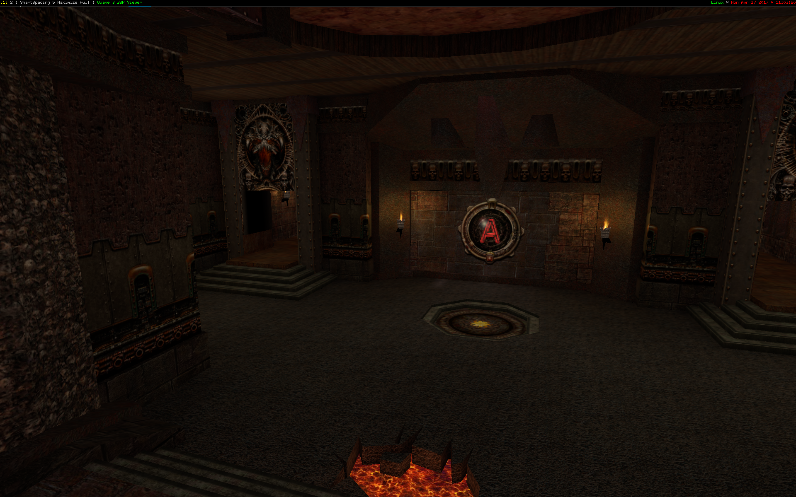

``hs-quake-3``
==============

Hello, welcome to the ``hs-quake-3`` repository! This project re-implements
various parts of the Quake 3 game in Haskell.

Features currently supported:
-----------------------------

* Most shader operations work. Most texture modulation functions work, multiple
  passes with blending, alpha testing and sorting are implemented.

* BSP file parsing, and use of the PVS data to perform occlusion culling.

Still to be done:
-----------------

* Sky boxes
* Fog
* Vertex deformation
* Curved surfaces
* Entities

Map
---

To give you an overview of the project:

* ``Quake3.Shader.Parser`` is responsible for parsing Quake 3 shader files into
  an AST.

* ``Quake3.Shader.TypeCheck`` "type checks" the result of parsing. At this
  stage, we register known shader opcodes and their parameters, and type check
  into a considerably richer data structure.

* ``Quake3.Shader.GL`` takes the result of type-checking, and can transform
  shaders into a graph of OpenGL calls. This graph is described by
  ``RenderGraph``.

* ``RenderGraph`` allows one to describe a rendering pipe-line out of smaller
  components. The idea behind the render graph is to collect and sort common
  operations - state changes in OpenGL are expensive, so we want to avoid them
  wherever possible. ``RenderGraph`` currently contains nodes necessary for
  rendering (most of) Quake 3 - nodes to bind texture stages, set shader
  parameters, enable multiple passes, and so.

  This module is independent of Quake 3, and may well be usable in other
  projects.

* ``GLObjects`` is a light wrapper around objects offered by OpenGL. Here we
  have what are essentially ``newtype`` wrappers around textures, vertex array
  objects, and helper functions to create/upload data.

* ``Wires.*`` contains the logic of the game. ``Wires.Game`` is responsible for
  taking the camera position, determining which clusters are visible to deliver
  a final render. ``Wires.Camera`` implements a rudimentary first-person camera,
  interpreting SDL keyboard and mouse events as matrix transformations.

* ``UI/Main`` forms the initialization process.
